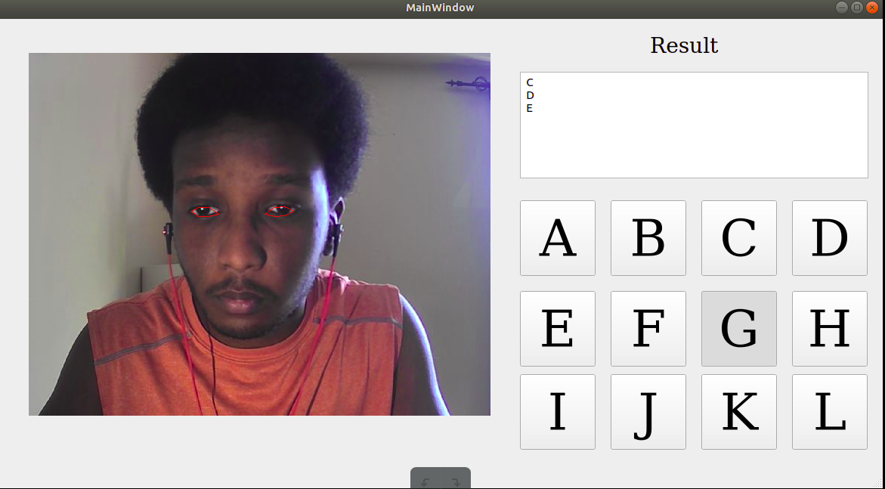

Gaze and blink controlled virtual keyboard ( prototype )

(Note) This project is developed for sake of  improving my own skills in C++ ,multithreading, computer vision and software design.

- Qt/C++ for development.
- Opencv and dlib are used for blink detection and gaze tracking.
- Virtual keyboard is under development
- Gaze tracking is not very accurate, needs further improvement.

This project was inspired by Pysource:

https://www.youtube.com/watch?v=VWUgkcX_KoY&list=PL6Yc5OUgcoTlvHb5OfFLUJ90ofBuoU5g8

Example of GUI:

